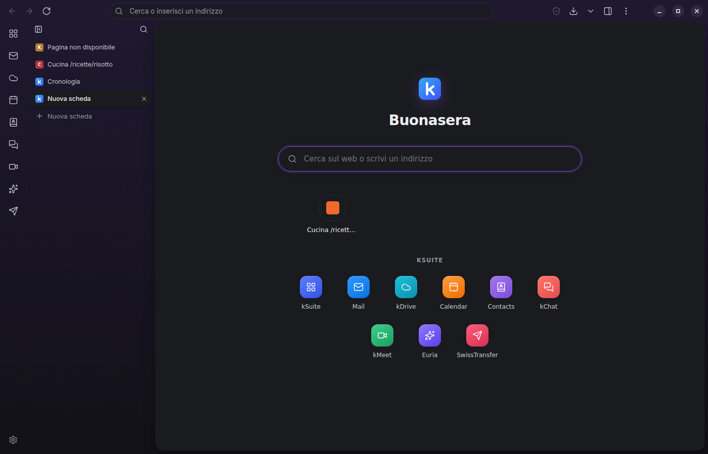

# kSuite Browser

Browser desktop (Windows, macOS, Linux) con le funzioni di **Infomaniak kSuite** integrate:
navighi il web come in un normale browser e hai kDrive, Mail, Calendar, kChat, kMeet ed Euria
a portata di clic, più un pannello nativo che usa le API ufficiali di Infomaniak.



## Perché Electron + TypeScript

| Opzione | Pro | Contro per un *browser* |
| --- | --- | --- |
| **Electron + TypeScript** ✅ | Motore Chromium incluso e identico su ogni OS, API mature per schede (`WebContentsView`), download, permessi, PDF, menu contestuali | App più pesante (~100 MB) |
| Tauri (Rust) | Leggero | Usa il webview di sistema (WebKitGTK/WebView2/WKWebView): rendering diverso per OS e supporto multi-webview ancora instabile |
| Qt / PySide (QtWebEngine) | Chromium incluso | UI e packaging più laboriosi, ecosistema web meno ricco |

Per un browser servono un motore di rendering completo e controllo fine su schede, download e permessi:
Electron è la scelta più solida. Le app web di Infomaniak (Mail, kDrive, kMeet…) sono ottimizzate per Chromium,
quindi funzionano senza sorprese.

## Funzioni

**Browser**
- Schede e più finestre, barra indirizzi/ricerca (DuckDuckGo, Qwant, Ecosia, Startpage, Google)
- **Suggerimenti nella barra degli indirizzi** da preferiti e cronologia, con navigazione da tastiera
- **Cronologia** (`ksuite://history`, `Ctrl+H`): ricerca, raggruppata per giorno, cancellazione di singole pagine o per periodo; mai registrata nelle finestre private
- **Preferiti**: stella nella barra degli indirizzi (`Ctrl+D`), barra dei preferiti (`Ctrl+Shift+B`), gestione (`ksuite://bookmarks`, `Ctrl+Shift+O`) con modifica, riordino e cartelle; **importazione ed esportazione** in formato HTML compatibile con Chrome, Edge, Firefox e Safari
- **Trova nella pagina** (`Ctrl+F`, `F3`/`Shift+F3`), con conteggio dei risultati e distinzione maiuscole/minuscole
- **Zoom** (`Ctrl +`, `Ctrl −`, `Ctrl+0`, `Ctrl`+rotellina) ricordato per ogni sito, zoom predefinito nelle impostazioni
- **Pagina nuova scheda** (`ksuite://newtab`): ricerca, siti più visitati (rimovibili) e app kSuite
- **Schede**: trascinamento per riordinarle, trascinamento fuori dalla finestra o in un'altra finestra per spostarle
  (la pagina resta aperta, senza ricaricarsi), schede fissate, audio on/off, duplicazione, "chiudi le altre",
  **riapri scheda chiusa** (`Ctrl+Shift+T`) con la sua cronologia avanti/indietro, `Ctrl+1…9`
- **Icone dei siti** salvate durante la navigazione e mostrate in preferiti, cronologia, suggerimenti e password
  (con un'iniziale colorata per i siti senza icona)
- Riapertura delle schede della sessione precedente (anche quelle fissate)
- Scorciatoie: `Ctrl+T`, `Ctrl+N`, `Ctrl+Shift+N` (finestra privata), `Ctrl+W`, `Ctrl+L`, `Ctrl+R`/`F5`, `Alt+←/→`, `Ctrl+Tab`, `Ctrl+,` (impostazioni), `Ctrl+Shift+Canc` (cancella dati), `Ctrl+PagSu/PagGiù` (schede), `F12` (su Mac: `⌘` al posto di `Ctrl`, cronologia con `⌘+Y`)
- Download con cartella configurabile o "chiedi dove salvare"
- **Cerca tra le schede** (`Ctrl+Shift+A` o la freccia in fondo alla barra delle schede): tutte le schede delle finestre aperte,
  dalla più recente, con ricerca, chiusura (`Shift+Canc`) e schede chiuse di recente da riaprire
- **Schede dormienti**: le schede non usate da un po' (1 ora, configurabile in Impostazioni › Generale) chiudono la pagina
  per liberare memoria e si ricaricano quando le apri, con la cronologia avanti/indietro intatta. Mai quelle fissate,
  delle app kSuite, con audio in riproduzione o con moduli compilati. Anche "Metti in pausa" nel menu della scheda
- **Avvio veloce**: le schede della sessione precedente partono in pausa, si carica solo quella in primo piano
- Con molte schede aperte la barra le riduce all'icona e poi scorre (rotellina del mouse)
- **Passa alla scheda**: se la pagina che cerchi nella barra degli indirizzi è già aperta (anche in un'altra finestra),
  il suggerimento porta alla sua scheda invece di aprirne un doppione
- **Anteprima della scheda** al passaggio del mouse: titolo completo, sito, memoria usata, stato (in pausa, audio)
- **Completamento automatico** nella barra degli indirizzi (scrivi `git` → `github.com/`) dai siti visitati e dai preferiti
- **Anteprima del link** in basso a sinistra al passaggio del mouse
- **Informazioni sul sito** (clic sul lucchetto o su "Non sicuro"): stato della connessione, permessi concessi al sito, cancellazione di cookie e dati del sito
- **Stampa** (`Ctrl+P`), **salva pagina con nome** in HTML completo o MHTML (`Ctrl+S`), **sorgente pagina** (`Ctrl+U`)
- **Visualizzatore PDF** integrato
- **Video a schermo intero** (YouTube e simili): la pagina occupa tutta la finestra, `Esc` per uscire
- **Pagine d'errore chiare** (nessuna connessione, sito inesistente, certificato non valido…) con "Riprova";
  pagina dedicata se una scheda si blocca e avviso "La pagina non risponde"
- **Correttore ortografico** in italiano e inglese con suggerimenti e "Aggiungi al dizionario" nel menu contestuale
- **Siti con accesso HTTP** (nome utente e password richiesti dal server o dal proxy) tramite la barra informazioni
- **Browser predefinito** (Impostazioni › Generale): i link delle altre app e i file HTML/PDF si aprono qui, aggiunti alla sessione ripristinata

**Ricerca kSuite** (`ksuite://search`, motore predefinito)
- Una sola ricerca dalla barra degli indirizzi trova insieme **preferiti e cronologia, file di kDrive, email, contatti ed eventi**, con le parole cercate evidenziate
- **Calcolatrice** integrata (`12*(3+4)`), senza confondere date e numeri di telefono
- Collegamenti per continuare **sul web** con il motore scelto (DuckDuckGo, Qwant, Ecosia, Startpage, Google)
- Clic su un contatto per scrivergli dal pannello Mail, su un file per aprirlo in kDrive
- Nelle finestre private la cronologia non viene mai mostrata

**Assistente IA** (Infomaniak AI Services, modelli ospitati in Svizzera)
- **Pannello IA** (`Ctrl+Shift+K` › IA): chat con risposte in streaming, azioni rapide sulla pagina aperta
  (riassunto, punti chiave, traduzione), opzione "Usa la pagina" per fare domande sul contenuto
- **Menu contestuale**: *Chiedi all'IA* sul testo selezionato (spiega, riassumi, traduci, migliora) e *IA: pagina* sulle pagine web
- **Domande dalla barra degli indirizzi**: scrivi `?` seguito dalla domanda (es. `?come si cucina il risotto`)
- **Risposta dell'IA nella ricerca kSuite**: su richiesta, o automatica se la attivi (mai automatica nelle finestre private)
- **Scrivi con l'IA** nel pannello Mail: bozza dell'email partendo dall'oggetto e dai tuoi appunti
- Le risposte sono mostrate come testo formattato costruito in modo sicuro (nessun HTML del modello viene eseguito);
  il contenuto delle pagine è passato al modello come dato, non come istruzioni
- Si attiva in Impostazioni › Intelligenza artificiale (prodotto, modello, "Prova")

**Gestore password** (`ksuite://passwords`, menu File › Password)
- Dopo un accesso compare una barra per **salvare o aggiornare** la password (con "Mai per questo sito")
- **Compilazione automatica** quando per un sito c'è un solo accesso (solo su HTTPS); altrimenti clic nel campo e scelta dal menu, che il sito non può imitare perché è nativo
- **Password sicure suggerite** nei moduli di registrazione (20 caratteri casuali)
- Pagina di gestione: ricerca, mostra/copia, modifica, eliminazione, avvisi per password **riutilizzate** o **deboli**, siti esclusi
- **Importazione CSV** da Chrome, Edge, Firefox, Safari, Bitwarden, 1Password; **esportazione CSV** (richiede la password principale)
- **Password principale** opzionale: blocca le password finché non la inserisci, con blocco automatico dopo 30 minuti di inattività
- Mai attivo nelle finestre private (nessun salvataggio né compilazione automatica)

**Impostazioni** (`ksuite://settings`, `Ctrl+,`)
- Generale: avvio, pagina iniziale, motore di ricerca, download
- Aspetto: tema chiaro/scuro/sistema, barra laterale kSuite
- Privacy e sicurezza, permessi dei siti, account kSuite, informazioni
- Ricerca tra le impostazioni

**Privacy e sicurezza**
- **Protezione dal tracciamento** con il motore Ghostery (EasyList, EasyPrivacy, liste uBlock Origin), liste aggiornate ogni settimana:
  *Standard* (pubblicità e tracker) o *Rigorosa* (anche banner dei cookie e altri fastidi)
- **Pulsante scudo** nella barra: quante richieste sono state bloccate e disattivazione delle protezioni per un singolo sito
- **Blocco dei cookie di terze parti** sulle richieste di rete
- **Do Not Track e Global Privacy Control** (`DNT: 1`, `Sec-GPC: 1`)
- **Modalità solo HTTPS**: le pagine `http://` vengono caricate in `https://`; se il sito non lo supporta compare un avviso con "Continua con HTTP" (le reti locali sono escluse)
- **Protezione da phishing e malware**: i siti che rubano password e dati e i file di malware conosciuti vengono bloccati
  con una pagina di avviso, usando gli elenchi pubblici del progetto malware-filter (gli stessi di uBlock Origin),
  aggiornati due volte al giorno e controllati **sul computer**: nessun indirizzo viene inviato ad altri
- **Link ad app esterne** (`mailto:`, Zoom, Teams…): il browser chiede prima di aprirli (con "ricorda per questo sito");
  i tipi usati per attacchi (`ms-msdt:`, `search-ms:`, `ms-appinstaller:`, `file:`…) sono sempre bloccati
- **Download pericolosi** (programmi, script, immagini disco, documenti con macro): conferma prima di scaricarli,
  con un avviso in più se arrivano da una connessione non cifrata
- **Popup di accesso** (Google, Microsoft, banche): il titolo della finestra mostra il sito e se la connessione è sicura
- **Identità del browser**: si presenta come un normale Chrome (senza "Electron" e il nome dell'app), più difficile da
  riconoscere e compatibile con gli accessi che rifiutano i browser Electron
- Le icone dei siti visitati non possono essere usate da una pagina web per scoprire la tua cronologia
- **Cancella dati di navigazione** (cookie e dati dei siti, cache, elenco download, permessi) e cancellazione automatica alla chiusura
- **Finestre private**: sessione solo in memoria (cookie, cache, permessi spariscono alla chiusura), i download non vengono caricati su kDrive
- **Permessi dei siti**: valori predefiniti (chiedi/blocca) per fotocamera e microfono, notifiche e posizione; scelte ricordate e revocabili

**Integrazione kSuite**
- Barra laterale con tutte le app della suite (ogni app resta in una scheda dedicata, login persistente)
- Badge con le email non lette, aggiornato ogni 2 minuti anche a pannello chiuso
- **Notifiche di sistema** per le nuove email e **promemoria degli eventi** di Calendar (anticipo configurabile);
  un clic sulla notifica apre Mail o Calendar. Si configurano in Impostazioni › Notifiche
- Pannello laterale (`Ctrl+Shift+K`):
  - **Home**: profilo, email non lette, eventi di oggi, ultime email
  - **kDrive**: sfoglia cartelle, cerca, scarica, carica file, scegli la cartella di destinazione
  - **Mail**: posta in arrivo e invio email
  - **Agenda**: eventi dei prossimi 7 giorni e creazione rapida di eventi
  - **Download**: con opzione "carica automaticamente su kDrive"
- **Salva la pagina come PDF su kDrive** (`Ctrl+Shift+S`, menu File o tasto destro sulla pagina)
- **Invia la pagina via Mail** (`Ctrl+Shift+M`, menu File o tasto destro sulla pagina)
- Menu contestuale: *Salva immagine/link su kDrive*, *Invia link via Mail*

## Configurare l'accesso alle API

1. Vai su [Manager Infomaniak → Token API](https://manager.infomaniak.com/v3/ng/accounts/token/list).
2. Crea un token con questi scope: `user_info`, `drive`, `workspace:mail`, `workspace:calendar`.
3. Apri **Impostazioni** (`Ctrl+,`) → *Account kSuite* → incolla il token → *Salva e verifica*.

Per l'**assistente IA** serve anche il prodotto **AI Services** attivo nel Manager Infomaniak
(è a consumo) e un token che includa anche lo scope relativo all'IA (AI Services). Poi Impostazioni → *Intelligenza artificiale* → attiva → *Prova*.

Il token è salvato cifrato con il portachiavi del sistema operativo (`safeStorage` di Electron)
e viene usato solo dal processo principale: le pagine web non possono leggerlo.
In alternativa puoi passarlo con la variabile d'ambiente `KSUITE_API_TOKEN`.

Se il tuo account ha più kDrive puoi sceglierlo nelle impostazioni (oppure indicare l'ID che trovi
nell'URL dell'app web: `.../kdrive/app/drive/<ID>`).

## Come sono protette le password

- Le password stanno in `passwords.json` nel profilo, cifrate con **AES-256-GCM** (una modifica al file ne impedisce la lettura).
- La chiave di cifratura è casuale e viene protetta dal **portachiavi del sistema** (Portachiavi di macOS, DPAPI di Windows,
  Secret Service/KWallet su Linux) oppure, se la imposti, dalla **password principale** (derivata con scrypt).
- Su Linux senza portachiavi Electron userebbe una chiave fissa uguale per tutti: in quel caso il browser la considera
  assente e chiede di impostare una password principale prima di salvare qualsiasi password.
- Le pagine web non possono leggere le password salvate di altri siti: l'origine di ogni richiesta è stabilita dal browser,
  non dalla pagina, e la compilazione avviene solo nel frame dello stesso sito.

## Sviluppo

Requisiti: Node.js 22+.

```bash
npm install
npm start          # compila e avvia
npm test           # test unitari (client API, omnibox, utilità)
npm run typecheck
```

### Creare l'installer

```bash
npm run dist:win     # .exe (NSIS)
npm run dist:mac     # .dmg e .zip
npm run dist:linux   # AppImage e .deb
```

Gli installer finiscono in `release/`. Avviando a mano la GitHub Action `CI` (*Run workflow*) vengono creati
per tutti e tre i sistemi come artefatti scaricabili, senza pubblicare nulla.

## Aggiornamenti automatici

L'app si aggiorna dalle [GitHub Releases](https://github.com/froll0/kSuiteBrowser/releases) del progetto
(controllo 30 secondi dopo l'avvio e poi ogni 6 ore, oppure da *Aiuto › Controlla aggiornamenti*).

| Installazione | Comportamento |
| --- | --- |
| Windows (.exe) | scarica in background e installa al riavvio (anche con "Riavvia ora") |
| Linux AppImage | come Windows |
| macOS (.dmg) | avvisa della nuova versione e apre la pagina di download (l'installazione automatica richiede un'app firmata con un certificato Apple Developer) |
| Linux .deb | avvisa della nuova versione e apre la pagina di download |
| `npm start` | disattivati |

In *Impostazioni › Aggiornamenti* si può disattivare il download automatico.

### Pubblicare una nuova versione

```bash
npm version patch        # oppure minor / major: aggiorna package.json e crea il tag vX.Y.Z
git push --follow-tags
```

Il tag avvia la GitHub Action che crea una release in bozza, compila Windows, macOS e Linux, carica installer e
file `latest*.yml` (letti dall'app per trovare gli aggiornamenti) e infine pubblica la release. Se il tag non
corrisponde alla versione di `package.json` la pubblicazione si ferma.

Gli installer non sono firmati: Windows SmartScreen e macOS Gatekeeper mostrano un avviso alla prima installazione.
L'app verifica comunque l'integrità di ogni aggiornamento (SHA-512 dal file `latest*.yml` scaricato via HTTPS).

## Struttura

```
src/
  api/        Client REST Infomaniak (profilo, kDrive, Mail, Calendar, Contatti, AI Services) — senza dipendenze da Electron
  main/       Processo principale: finestre, schede, privacy, download, permessi, menu, IPC
  preload/    Ponti sicuri (contextBridge): UI del browser e pagine interne ksuite://
  renderer/   Interfaccia del browser (barra schede, sidebar, pannello kSuite)
  pages/      Pagine interne: ksuite://newtab, search, settings, history, bookmarks, passwords, https-only
  shared/     Tipi, canali IPC, schema delle impostazioni, regole privacy, barra indirizzi
test/         Test Vitest
```

## API utilizzate

| Servizio | Endpoint |
| --- | --- |
| Profilo | `GET api.infomaniak.com/2/profile` |
| kDrive | `GET /2/drive`, `GET /3/drive/{id}/files/{dir}/files`, `GET /3/drive/{id}/files/search`, `GET /2/drive/{id}/files/{file}/download`, `POST /3/drive/{id}/upload` |
| Mail | `GET mail.infomaniak.com/api/mailbox`, `.../mail/{mailbox}/folder`, `.../folder/{id}/message`, `POST/PUT .../draft` |
| Calendar | `GET /1/calendar/pim/calendar`, `GET/POST /1/calendar/pim/event` |
| Contatti | `GET /1/calendar/pim/contact/all` |
| AI Services | `GET /1/ai`, `GET /1/ai/models`, `POST /2/ai/{product_id}/openai/v1/chat/completions` (compatibile OpenAI, streaming SSE) |

Sono gli stessi endpoint usati dai connettori MCP ufficiali di Infomaniak.

## Sicurezza dell'app installata

L'installer attiva i *fuse* di Electron: niente `ELECTRON_RUN_AS_NODE`, `NODE_OPTIONS` o `--inspect`,
codice caricato solo dall'archivio `app.asar` (verificato su Windows e macOS), cookie cifrati su disco.

## Limiti noti

- Il blocco dei cookie di terze parti agisce sulle richieste di rete: uno script dentro un iframe di terze parti
  può ancora usare `document.cookie` all'interno di quell'iframe.
- Il browser si basa su Electron, che riceve gli aggiornamenti di sicurezza di Chromium con qualche settimana di ritardo:
  aggiorna regolarmente le dipendenze (`npm update electron`).

- Il caricamento diretto su kDrive è limitato a 1 GB per file (per file più grandi usa l'app web).
- Il pannello Mail usa la casella principale associata al token.
- L'app non è ancora firmata digitalmente: Windows mostra l'avviso di SmartScreen e macOS chiede conferma all'apertura
  (sul Mac gli aggiornamenti automatici richiedono la firma).
- L'assistente IA usa i crediti di AI Services: i nomi dei modelli disponibili dipendono dal catalogo Infomaniak
  (se "Automatico" non ti soddisfa scegli il modello nelle impostazioni).

## Crediti

- Icone: [Lucide](https://lucide.dev) (licenza ISC).
- Font: [Inter](https://rsms.me/inter/) di Rasmus Andersson (SIL Open Font License 1.1, testo in `src/renderer/fonts/LICENSE-Inter.txt`).
- Le icone delle app kSuite nella barra laterale sono pittogrammi generici: i loghi e i marchi Infomaniak appartengono ai rispettivi titolari.
- L'icona dell'app è in `build/icon.svg`; `npm run icon` rigenera `build/icon.png`.
